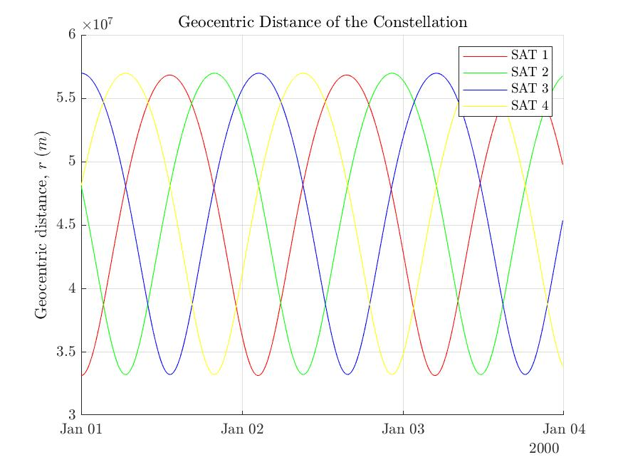
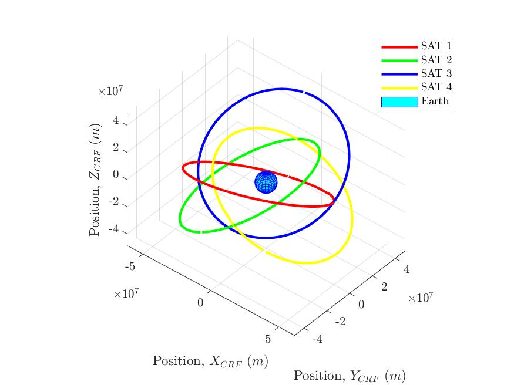

# John Draim's Constellation

In the 1980s, John Draim proposed a ground-breaking satellite constellation design using just four satellites to achieve full global coverage. This design, based on a perturbed tetrahedral configuration, offers substantial economic advantages and a wide range of applications, including communications, Earth observation, and meteorology.

This project focuses on analysing Draim's constellation over a two-day period. Key tasks include calculating orbital parameters, converting coordinate systems, and visualizing the results.

## Input Data

The constellation is modeled as a modified tetrahedron with the following orbital parameters:

<table class="table" style="width: auto !important; margin-left: auto; margin-right: auto;">
  <thead>
    <tr>
      <th>Satellite</th>
      <th>Inclination</th>
      <th>Orbital Period (h)</th>
      <th>Eccentricity (e)</th>
      <th>Argument of Perigee (ω)</th>
      <th>RAAN (Ω)</th>
      <th>Mean Anomaly (M₀)</th>
    </tr>
  </thead>
  <tbody>
    <tr>
      <td>S1</td>
      <td>31.3°</td>
      <td>26.49</td>
      <td>0.263</td>
      <td>-90°</td>
      <td>0°</td>
      <td>0°</td>
    </tr>
    <tr>
      <td>S2</td>
      <td>31.3°</td>
      <td>26.49</td>
      <td>0.263</td>
      <td>90°</td>
      <td>90°</td>
      <td>270°</td>
    </tr>
    <tr>
      <td>S3</td>
      <td>31.3°</td>
      <td>26.49</td>
      <td>0.263</td>
      <td>-90°</td>
      <td>180°</td>
      <td>180°</td>
    </tr>
    <tr>
      <td>S4</td>
      <td>31.3°</td>
      <td>26.49</td>
      <td>0.263</td>
      <td>90°</td>
      <td>270°</td>
      <td>90°</td>
    </tr>
  </tbody>
</table>

The satellite position and velocity data at 600-second intervals of the first three days of 2001 has been considered in order to develop this study.

## Geocentric Satellite coordinates
Satellite coordinates in the Earth-Centered Earth-Fixed (ECEF) system can be transformed to spherical geocentric coordinates (r, λ, ϕ) using MATLAB’s `cart2sph` function. The geocentric distance has been plotted as a function of time, revealing periodic sinusoidal behaviour.

        

## Satellite Ground Tracks
The spherical coordinates were used to plot ground tracks over the Earth’s surface in the geocentric Terrestrial Reference Frame (TRF). The analysis showed periodic patterns consistent with orbital parameters.

    <video controls width="80%" height="auto">
      <source src="../images/john_draim_constellation/ground_track_video.mp4" type="video/mp4">
      Your browser does not support the video tag.
    </video>

## Coverage  
Coverage is analyzed by overlaying the constellation on a latitude-longitude grid. For a location to be "covered," the satellite's elevation angle must exceed 5°, ensuring reliable communication or observation.

 

    <video controls width="80%" height="auto">
      <source src="../images/john_draim_constellation/coverage_video.mp4" type="video/mp4">
      Your browser does not support the video tag.
    </video>

 

Over the studied three-day period, the majority of Earth’s surface is covered by 1–2 satellites simultaneously:

- No coverage: 1.04%
- 1 satellite coverage: 51.14%
- 2 satellite coverage: 45.48%
- 3 satellite coverage: 2.35%

The analysis highlights efficient coverage with negligible downtime, validating Draim’s design.

## Coordinate Transformation to Celestial Reference Frame (CRF)  
Satellite coordinates are transformed to the Celestial Reference Frame using the Greenwich Mean Sidereal Time. This transformation allows visualization of the orbits in a stable inertial frame, providing an independent view unaffected by Earth’s rotation or precession.

        

## Conclusion
John Draim's four-satellite constellation demonstrates an innovative balance of efficiency and functionality. The constellation achieves near-global coverage with minimal overlap, offering significant implications for cost-effective satellite design. This analysis affirms the robustness of Draim’s design and its potential applicability across diverse fields, from meteorology to global communications.

## References

- Draim, J. "Three- and four-satellite continuous-coverage constellations"