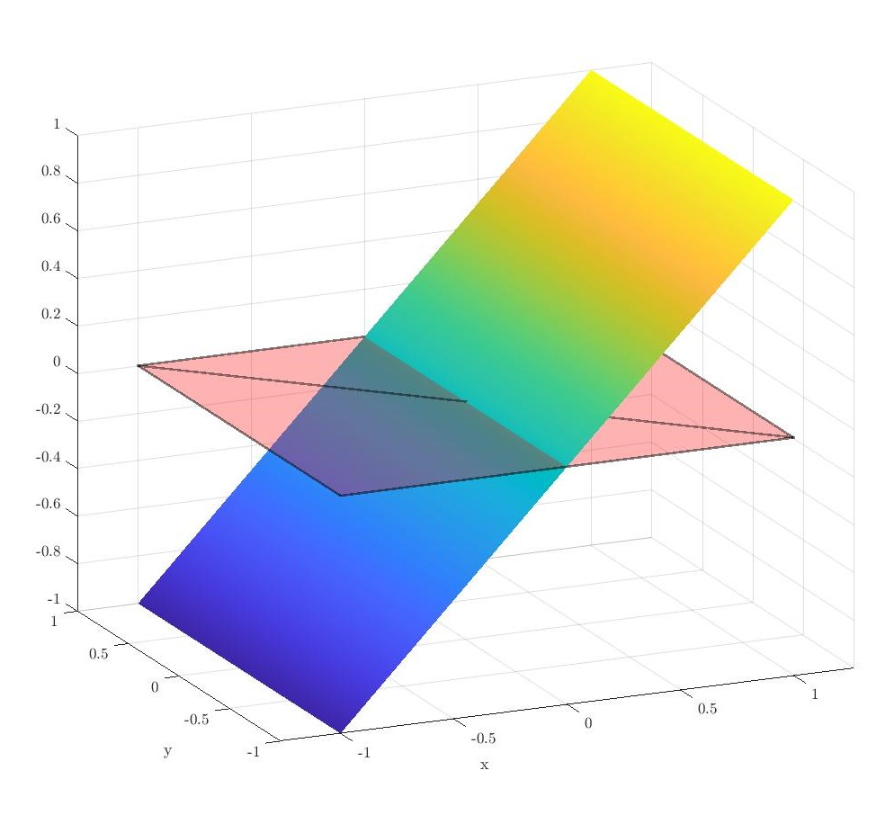
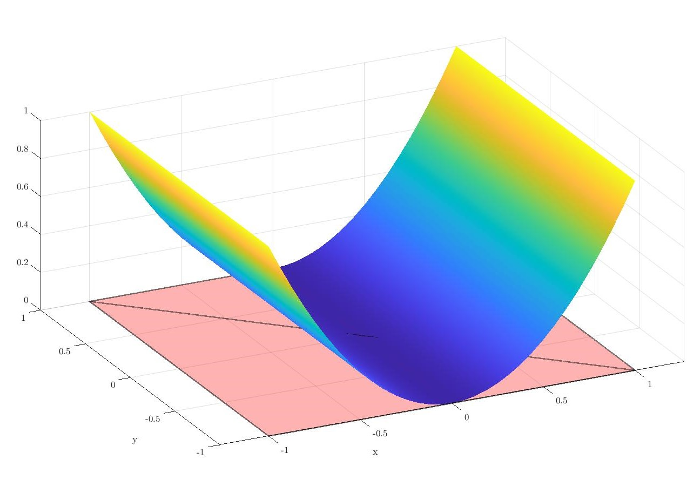
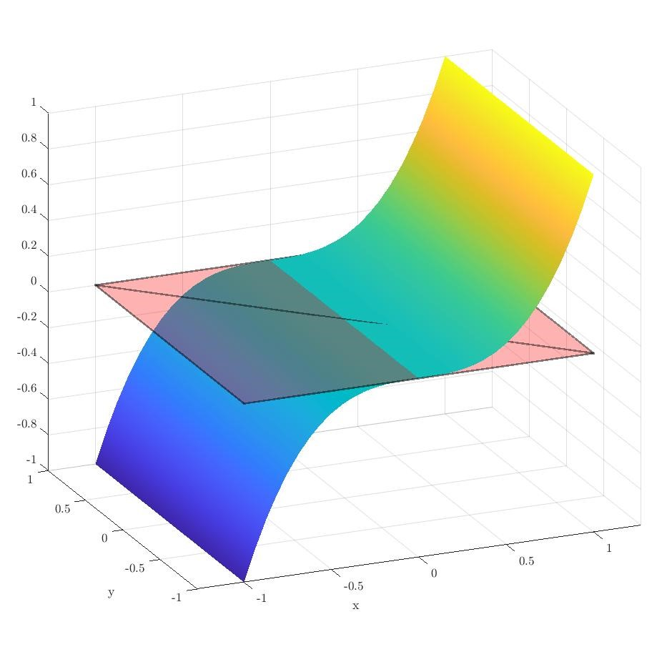
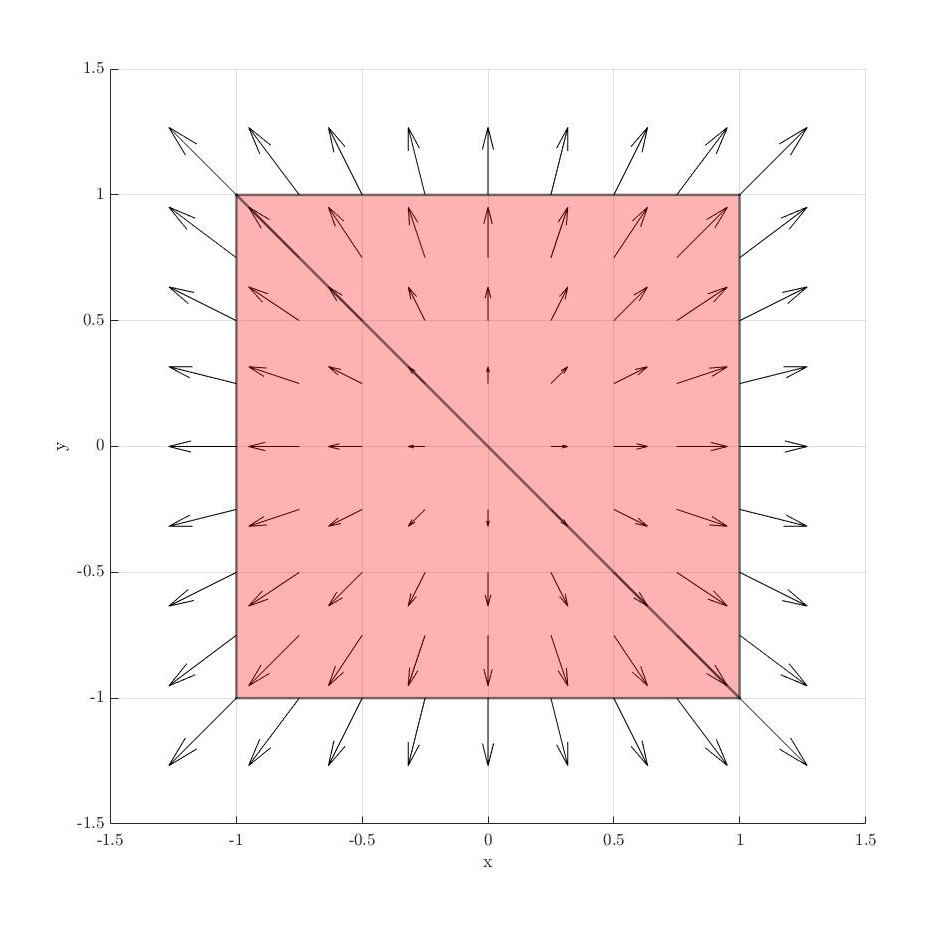
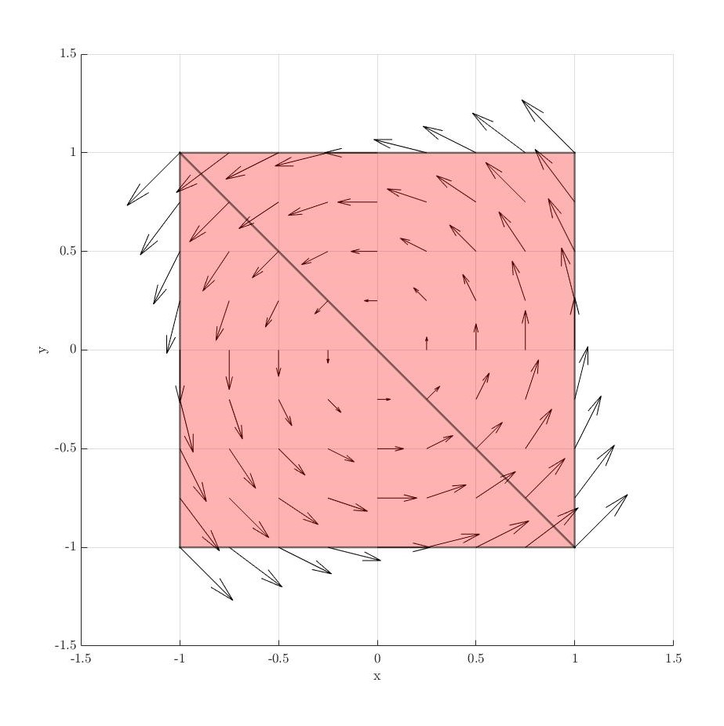
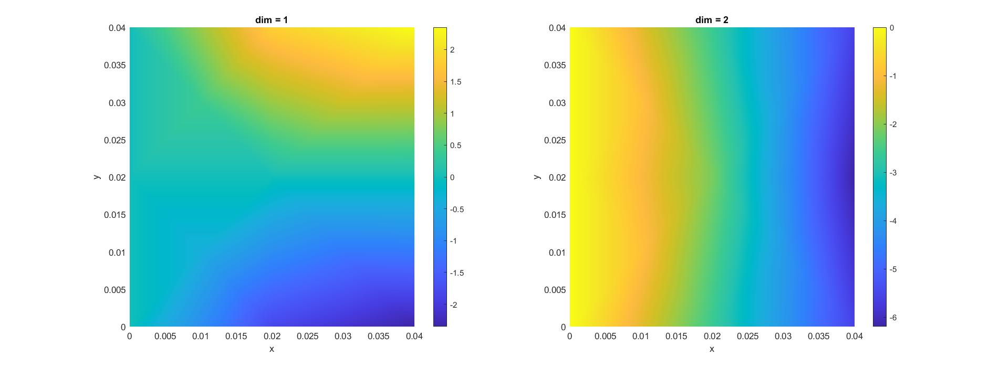
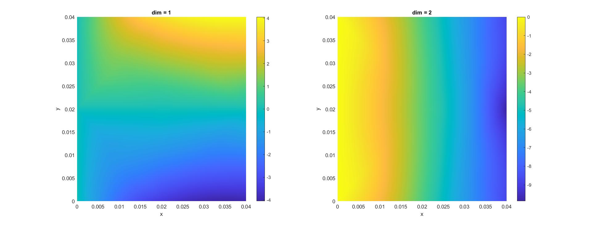

# Study of Finite Element Discretizations for Multi-Physics Problems

This article showcases my Bachelor's Thesis, which I successfully defended in July 2023. The thesis delves into the vast and intricate field of finite elements, with a particular focus on exploring different finite element types. You can access the full thesis report <a href="https://drive.google.com/file/d/1o9SMY_FazIICwAvZ21dN-WPyR2CTNfkw/view?usp=drive_link" target="_blank">here</a> and the presentation slides from the defense <a href="https://drive.google.com/file/d/1Jv4S16Dv37XPFL1sw-4oiLnWr6MocGbl/view?usp=sharing" target="_blank">here</a>.

## Introduction
Multi-physics problems involve the complex interplay of multiple physical phenomena or disciplines, such as fluid dynamics, heat transfer, structural mechanics, and electromagnetic fields. These interactions often influence the overall behavior of systems, requiring sophisticated computational methods to model and solve them accurately. 

The **Finite Element Method (FEM)** is a powerful tool for such challenges due to its flexibility and adaptability. By discretizing complex domains into smaller elements, FEM allows researchers to approximate solutions to partial differential equations with remarkable accuracy. This thesis builds upon these principles, focusing on improving the capabilities of the **Swan framework**, an open-source FEM software developed in MATLAB.

## Objectives
This thesis aimed to address the growing need for robust multi-physics solutions by focusing on three core objectives:

1. **Theoretical Foundations**: To review and study the mathematical principles underlying finite elements, including their definition, properties, and implementation.
2. **Integration into Swan Framework**: To implement new finite element types (Lagrange, Raviart-Thomas, and Nédélec) into Swan, adhering to its object-oriented architecture and clean code practices.
3. **Practical Demonstrations**: To validate the implemented methods by solving benchmark problems, such as projections to the $L^2(\Omega)$ space and the equations of linear elasticity.

By achieving these goals, the study sought to enhance Swan's potential for handling multi-physics problems efficiently.

## Mathematical and Theoretical Foundations
The study began with an in-depth exploration of the **Ciarlet triplet**, a mathematical representation of finite elements comprising:
- $K$: The geometric domain over which the element is defined.
- $P$: The vector space of functions used to approximate the solution.
- $\Sigma$: A set of linear forms or degrees of freedom that define the behaviour of the element.

This analysis focused on three specific finite element types:
- **Lagrange Elements**: Versatile elements commonly used for their simplicity and adaptability.
- **Raviart-Thomas Elements**: Designed for vector fields, these elements are well-suited for problems involving conservation laws.
- **Nédélec Elements**: Particularly effective for modelling electromagnetic fields, capturing tangential continuity across boundaries.

### Lagrange Elements
Lagrange elements are the most commonly used finite elements due to their simplicity and versatility. Two types of Lagrange elements are usually used:

**Simplicial Lagrange** elements are defined by the following **Ciarlet triplet** $\{K, P, \Sigma\}$:
- A simplex is used as the element $K$ of the triplet (e.g., a line, triangle, tetrahedron, etc.).
- $P$ is the space $\mathbb{P}_{k}$ of polynomials defined as:

$$
\mathbb{P}_{k} = \left\{ p(x) = \sum_{\substack{
    0 \leq i_1, \dots, i_d \leq k \\
    i_1 + \dots + i_d \leq k
}} \alpha_{i_1 \dots i_d} x_1^{i_1} \dots x_d^{i_d} \mid \alpha_{i_1 \dots i_d} \in \mathbb{R} \right\}
$$

- $\Sigma$ is the set $\sigma_{i}(p) = p(a_{i})$ where $\{a_{i}\}_{1\leq i\leq n_{sh}}$ are the nodes of the element.

On the other hand, **Tensor Product Lagrange** elements are defined by:
- A cuboid as $K$ (e.g., a line, rectangle, etc.).
- $P$ is the space $\mathbb{Q}_{k}$ of polynomials defined as:

$$
\mathbb{Q}_{k} =\left\{p( x) =\sum_{\small0\leq i_{1} ,\,...,\,i_{d} \leq k\normalsize}\alpha _{i_{1} ...i_{d}} x_{1}^{i_{1}} ...x_{d}^{i_{d}} ;\ \ \alpha _{i_{1} ...\, i_{d}} \in \mathbb{R}\right\}
$$

- $\Sigma$ is again the set $\sigma_{i}(p) = p(a_{i})$.

### Raviart-Thomas Elements
Raviart-Thomas elements are essential for problems involving vector fields, especially when flux continuity is required across element boundaries. They are defined by the following **Ciarlet triplet** $\{K, P, \Sigma\}$:

- $K$ is a simplex.
- $P$ is the vector space
$$
  \mathbb{RT}_k = \left\{ \mathbf{p}(x) = \mathbf{q}(x) + \mathbf{r}(x), \ \mathbf{q}(x) \in \mathbb{P}_k^d, \ \mathbf{r}(x) \in \mathbb{P}_{k-1}^d \cdot \mathbf{x}, \ \mathbf{q}, \mathbf{r} : K \rightarrow \mathbb{R}^d \right\},
  $$
  where $\mathbb{P}_k^d$ is the space of vector polynomials of degree $k$, and $\mathbb{P}_{k-1}^d \cdot \mathbf{x}$ introduces divergence continuity across faces.
- The linear forms in $\Sigma$ are associated with the normal components of the vector field on the element’s edges or faces:
$$
  \sigma_i(\mathbf{p}) = \int_{F_i} \mathbf{p} \cdot \mathbf{n} \, dS,
$$
  where $F_i$ is a face ($d=3$) or edge ($d=2$) of the element, and $\mathbf{n}$ is the outward normal vector.

### Nédélec Elements
Nédélec elements are critical for solving problems involving curl-conforming vector fields, such as electromagnetic wave propagation. They are defined by the following **Ciarlet triplet** $\{K, P, \Sigma\}$:

- $K$ is again a simplex.
- $P$ is the vector space $\mathbb{N}_{k}$
$$
  \mathbb{N}_k = \left\{ \mathbf{p}(x) = \mathbf{q}(x) + \mathbf{r}(x) \times \mathbf{x}, \ \mathbf{q}(x) \in \mathbb{P}_{k-1}^d, \ \mathbf{r}(x) \in \mathbb{P}_{k-1}^d \right\},
  $$
  where $\mathbf{q}$ ensures tangential continuity, and $\mathbf{r} \times \mathbf{x}$ allows for curl-conforming properties.
- The linear forms in $\Sigma$ are associated with the tangential components of the vector field along edges:
$$
  \sigma_i(\mathbf{p}) = \int_{e_i} \mathbf{p} \cdot \mathbf{t} \, dl,
  $$
  where $e_i$ is an edge of the element, and $\mathbf{t}$ is the tangent vector.

## Practical Problem Solving
The new finite elements were applied to solve several physical problems, including:
- **Projection to $L^2(\Omega)$ Space**: Using shape functions to approximate solutions in the $L^2$ norm.
- **Linear Elasticity**: Solving equations governing the deformation of elastic materials under applied forces, a cornerstone problem in structural mechanics.

### Projections to $L^2 (\Omega)$
Every element implemented has been tested with a projection. Here are some examples:

- Lagrange elements:

  
  
  

- Raviart-Thomas elements:

    

- Nédélec elements:

        

### Linear Elasticity
Additionaly, a benchmark linear elasticity problem was solved with the Lagrangian elements, here are the solutions for the implemented $P1$ and $P2$ elements.

- $P1$ solution:

    

- $P2$ solution:

    

## Implementation in Swan Framework
The [Swan framework](https://github.com/SwanLab/Swan), developed by CIMNE, serves as a collaborative, open-source FEM tool for solving various structural, fluid, and optimization problems. The implementation process followed these steps:
- **Object-Oriented Programming (OOP)**: All new elements were integrated into Swan's existing OOP architecture to ensure compatibility and scalability.
- **Clean Code Practices**: Emphasis was placed on creating readable, maintainable, and reusable code for future expansions.
- **Validation**: Each implementation was rigorously tested against benchmark cases to ensure accuracy.

## Conclusion and Future Work
This thesis establishes a solid foundation for solving multi-physics problems using the finite element method within the Swan framework. While the current implementation focuses on specific elements and problems, it provides a roadmap for extending Swan's capabilities. Potential future directions include:
- Expanding the library of finite elements to address additional multi-physics scenarios.
- Improving computational efficiency through advanced algorithms and parallel computing techniques.
- Applying the framework to real-world problems in aerospace, energy, and biomedical engineering.